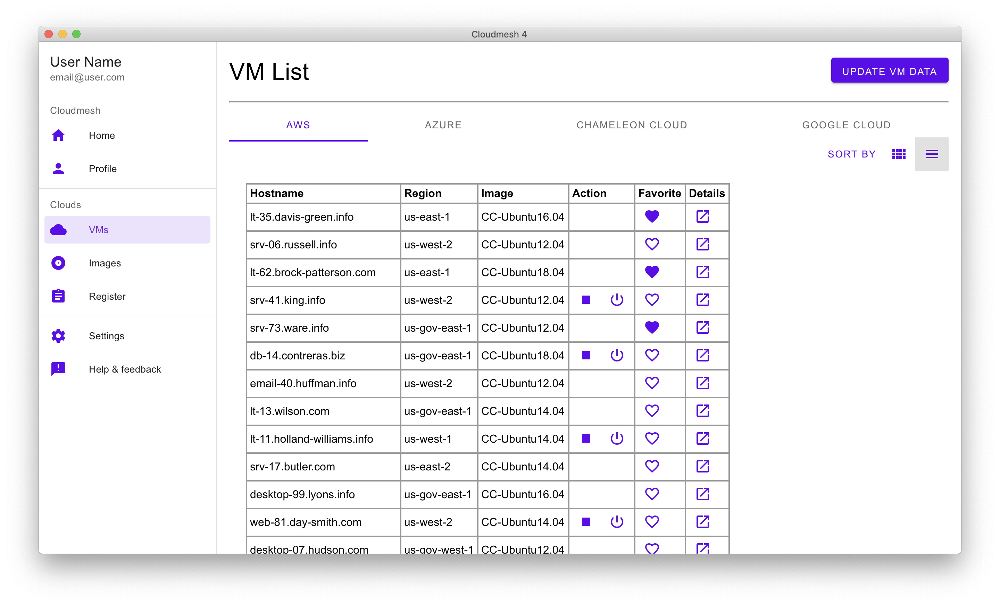
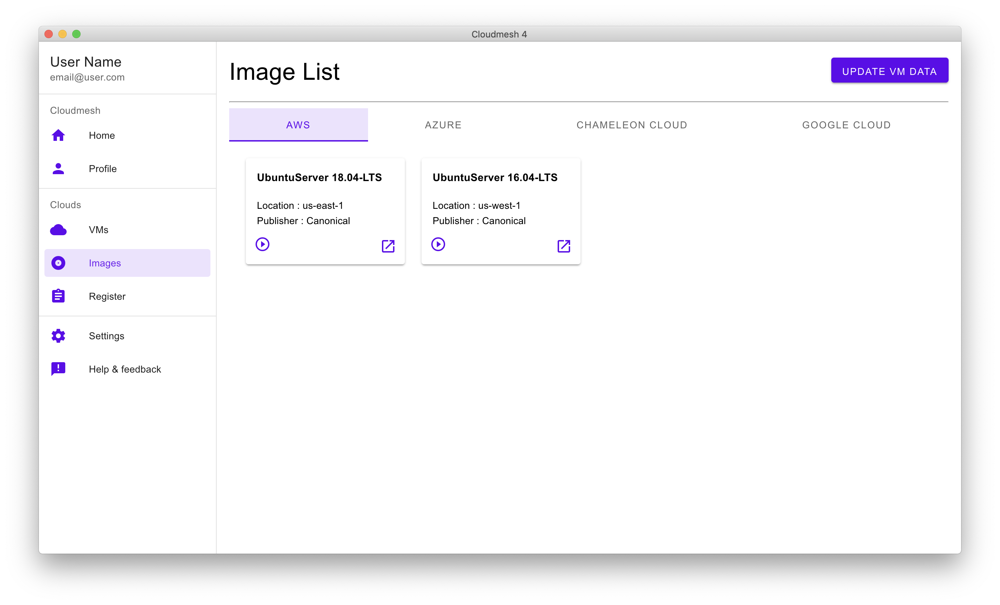

# Cloudmesh App #

This is project for Cloudmesh GUI using electronjs and backend using graphql-flask-python.

## Quick start

This app consists for two sub modules

* app - A cross-platform ElectronJS app which will be distributed to users
* server - The GraphQL server for app to get data. This server will run on cloud.

## Development

Below steps needs to be performed to setup development environment

### Python virtualenv

We assume you do propper python virtual environments either with the build in capabilities of python3 or pyenv

#### Pyenv

See our documentation of pyenv in ... :o: add link to book here

#### Python 3 

Execute following commands in workspace

```bash
python3 -m venv cloudmesh-graphql-server
cd cloudmesh-graphql-server
source bin/activate
```

## Installation

The framework can easily be installed with or convenient one line get method

:o: put this here and develope the get

For now you can use the setup via Makeile or per hand

### Setup and Run via Makefile

Setup via our Makefile is simple 

```bash
$ git clone git@github.com:cloudmesh-community/graphql.git
$ cd graphql
$ make install
```

To Run it you can simply say

```bash
make test
```


### Setup by hand

To set up the environment by hand you will have to setup the server and the GUI

#### Setup Server

To setup server execute following commands after cloning repository

```bash
git clone git@github.com:cloudmesh-community/graphql.git
cd graphql
cd cloudmesh-graphql-server
pip install -r requirements.txt
python app.py
```

To seed more data, add it in database.py, call `init_db()` from main and then run app again

#### Setup the GUI

To set up UI project execute following commands after cloning repository

```bash
cd graphql/app
npm install --save-dev node-sass
npm install
npm run build
```

For development purpose app assumes that server is running on following URL

* http://localhost:5000/graphql/

start app using

```bash
npm start
```

It will open up an application where you will see title and data it got from python server.


## Screenshots

For now we only provide a limited number of screenshots. Please note that they are done with *fake data*







	
